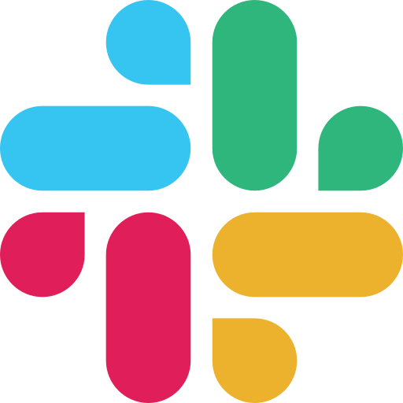

# Hi, I'm Mohamed Asaad 👋🏻

👨🏻‍💻 About Me

- 🚀  A software engineer with strong knowledge of web and mobile development.
- 🎓  Graduated from Faculty of Computer Science And Information Technology Tanta University.
- 💡  Passionate about discovering new technologies and creating innovative software solutions and quick hacks.
- 🛠️  Just can use the right tool for the job and not vice versa.

🔮 Tech Stack & Skills

- Scripting Languages       : JavaScript
- Programming Languages     : TypeScript
- Another languages         : HTML, CSS, MarkDown
- Styling Libraries         : TailwindCSS, Styled-Components
- Single Page App libs      : ReactDOM
- Mobile Development        : React Native
- Module Bundlers           : Webpack
- Meta Framework            : NextJS
- Authentication            : JWT, Auth.js
- State Management          : Redux-toolkit, XState, react-hook-form
- API Architecture Patterns : RESTful, GraphQL, WebSocket, Webhook
- Containers                : Docker, K8S
- Testing                   : Jest, Cypress, Puppeteer
- Run time Environment      : NodeJS
- Validations               : Zod
- Back-end Framework & lib  : Express, Formidable
- Content Managment System  : Sanity
- Object Relational Mappers : DrizzleORM, Prisma, Mongoose, Redis
- Databases                 : Relational, Document Oriented, Key-Value Database

🤝🏻 Contact Me

&nbsp;
&nbsp;
&nbsp;
&nbsp;
&nbsp;
&nbsp;
&nbsp;
&nbsp;
&nbsp;
